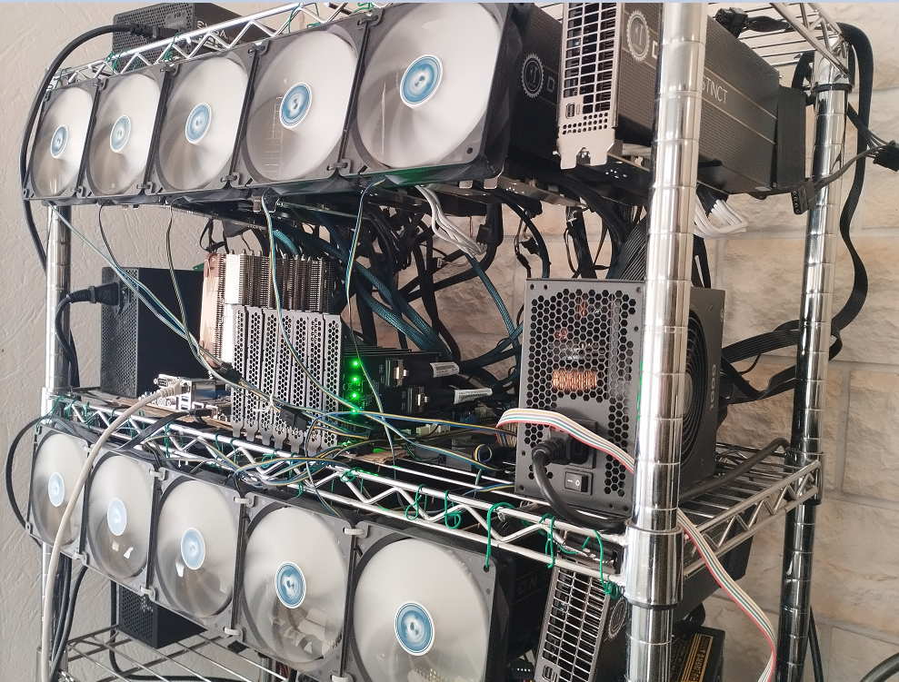

# Guidances for Test setup of 16 AMD MI50 32GB (Deepseek v3.2)



**Goal: run Deepseek V3.2 AWQ 4-bit on most cost effective hardware like 16*MI50 at decent speed (token generation & prompt processing)**

**Power draw**: 550W (idle) / 2400W (peak inference)

**Feel free to ask any questions and/or share any comments in the issues section here or in the medium article:** 
https://medium.com/@ai-infos/16x-amd-mi50-32gb-at-10-t-s-tg-2k-t-s-pp-with-deepseek-v3-2-vllm-gfx906-70e28ac70957

## Hardware details

- 16x AMD MI50 32GB (with 2 small fans 50mm per GPU at the back)
- Motherboard with 7 PCIe 4.0 ports x16 (ROMED8-2T)
- AMD EPYC CPU with 128 lanes (like 7642 with its 48 cores 2.3 GHz or other)
- 2x 64 GB ram DDR4 3200 ECC
- 4x PSU 1800W (with 3 add2psu)
- 12x SlimSAS PCIe device adapters 2x 8i
- 4x SlimSAS PCie device 1x 4i (C-payne)
- 12x SlimSAS cables 8i
- 2x SlimSAS cable 8i to 2x4i
- 7x SlimSAS PCIe host adapter
- 1x NVME drive
- 4x PWM HUB FAN Sata
- (optional) 10x Fans 140mm 

### Some relevant advices to avoid fires (non-exhaustive):

1) Do your own researches and always understand what you do when it's related to safety.
2) Draw an electrical plan of your home (avoid trusting existing plan, especially for old building) and check the maximum amperage/voltage allowed per circuit / power strip / smart plug. 
3) Always check the specs of the PSU you want to buy to see max wattage per cable (usually but not always: SATA ~54W, Molex ~132W, 6pin ~75W, 8pin ~150W per cable). The 'per cable' is important because it means that if you have 1 cable with 2*8pin at the end, it's actually 75W per 8pin in this case. For example, if you have a PSU saying that it has 8*(2*8pin), it's in total 16 8pin but you can only power 4 MI50 (having each 2*8pin and requiring 300W per card). /!\ Even if you cap the power draw of you card to 150W, this is not advised to plug only 1 cable of 2*8pin; this is better to have 2 cables of 2*8pin per MI50, and for the remaining 8pin, it can be used for the extender (if 6+2pin). 
4) Don't forget that your PSU needs also the right number of SATA/molex/6pin for PWM HUB, add2psu and extenders (extenders with molex or 6 pin are better than sata as they usually required more power to be steady)
5) The fan port of your motherboard usually supports ~1A so don't plug too many fans (having more than 1A in total) on it, if you don't want to burn your motherboard (or more). That's why PWM HUB FAN is often required for this kind of setup as the motherboard does not have enough fan ports.

## Software details

- Ubuntu v24.04 (kernel: 6.11.0-17-generic)
- ROCM v6.3.4
- torch v2.9
- triton-gfx906 v3.5
- vllm-gfx906-deepseek v0.12.0 (https://github.com/ai-infos/vllm-gfx906-deepseek/tree/gfx906/v0.12.0)
- MI50 bios: 32G_UEFI.rom  (available there: https://gist.github.com/evilJazz/14a4c82a67f2c52a6bb5f9cea02f5e13 /!\ don't flash your bios if you don't know what you do; the stock bios might work in your setup)
- open-webui
- Custom motherboard bios to boot with 16 MI50: ask ASRock Rack support for this ROM or in the meantime, boot with 14 GPU and use hotplug to make it run with 16 under Ubuntu (see below for more details)


## Run 16 AMD MI50 under Ubuntu (required: hotplug support for the motherboard) if boot is capped at 14 GPU

1) Modify the following motherboard bios settings from default (NB: some setting modifications are optional and some settings might be shown differently for your bios/motherboard):

- advanced > chipset config > primary graphic adapter: onboard / onboard debug port LED: off
- advanced > chipset config > amd pcie link speed > pcie1 to 7 gen3, ocu1 ocu2 m2_1 gen1, m2_2 gen4 / amd pcie link width > pcie1 x4x4x4x4 and all other pcie x8x8 / amd pcie hot plug > pcie7 hotplug: enabled
- advanced > sata > hotplug disabled
- advanced > super io config: all disabled
- advanced > amd cbs > fch common options > all sata & sata controller options disabled
- advanced > amd cbs > nbio common options > hd audio disabled 
- boot > csm > csm: custom / all pcie1 to 7 & ocu1 & ocu2 slot oprom : disabled ; m2_2 slot oprom: UEFI

2) Linux kernel update:

- Add in linux kernel grub option via vim /etc/default/grub: `pcie_ports=native pci=realloc=on pciehp.pciehp_force=1 pci=assign-busses pci=hpmmioprefsize=128G pci=hpmemsize=128G pci=hpmmiosize=16G pci=hpiosize=4M pci=hpbussize=16` 
- `sudo update-grub`
- `sudo reboot`
- Some command examples to verify everything's ok: 
```code
sudo dmesg | grep pciehp
sudo dmesg | grep -i -E "pci|bar|resource|alloc|fail|mi50|amdgpu"
sudo dmesg -T | tail -n 100
lspci -tv && rocm-smi
```

## Relevant commands to run

### ROCm & amdgpu drivers

```code
# Get the script that adds the AMD repo for 24.04 (noble)
wget https://repo.radeon.com/amdgpu-install/6.3.4/ubuntu/noble/amdgpu-install_6.3.60304-1_all.deb
sudo apt install ./amdgpu-install_6.3.60304-1_all.deb

# Install ROCm  6.3.4 including hip, rocblas, amdgpu-dkms etc (assuming the machine has already the advised compatible kernel 6.11)
sudo amdgpu-install --usecase=rocm --rocmrelease=6.3.4    

sudo usermod -aG render,video $USER

# Verify ROCm installation
rocm-smi --showproductname --showdriverversion
rocminfo

# Add iommu=pt if you later grow beyond two GPUs
# ROCm’s NCCL-/RCCL-based frameworks can hang on multi-GPU rigs unless the IOMMU is put in pass-through mode
# see https://rocm.docs.amd.com/projects/install-on-linux/en/docs-6.3.3/reference/install-faq.html#multi-gpu

sudo sed -i 's/GRUB_CMDLINE_LINUX_DEFAULT="/GRUB_CMDLINE_LINUX_DEFAULT="iommu=pt /' /etc/default/grub
sudo update-grub
sudo reboot
cat /proc/cmdline  # >>> to check: must return: "BOOT_IMAGE=... iommu=pt"

```

### vllm-gfx906-deepseek fork with its dependencies (torch, triton, python, etc)

```code

pyenv install 3.12.11
pyenv virtualenv 3.12.11 venv312
pyenv activate venv312

# TRITON

git clone --branch v3.5.0+gfx906 https://github.com/nlzy/triton-gfx906.git
cd triton-gfx906
pip install 'torch==2.9' torchvision torchaudio --index-url https://download.pytorch.org/whl/rocm6.3  
pip install -r python/requirements.txt
pip wheel --no-build-isolation -w dist . 2>&1 | tee build.log
pip install ./dist/triton-*.whl  


# VLLM

git clone --branch v0.12.0+gfx906.update1 --single-branch https://github.com/ai-infos/vllm-gfx906-deepseek.git
cd vllm-gfx906-deepseek
pip install 'cmake>=3.26.1,<4' 'packaging>=24.2' 'setuptools>=77.0.3,<80.0.0' 'setuptools-scm>=8' 'jinja2>=3.1.6' 'amdsmi>=6.3,<6.4' 'timm>=1.0.17'
pip install -r requirements/rocm.txt
pip wheel --no-build-isolation -v -w dist . 2>&1 | tee build.log
pip install ./dist/vllm-*.whl

```

### Download DEEPSEEK V3.2 AWQ (4-bit)

```code
mkdir -p ~/llm/models/DeepSeek-V3.2-AWQ && cd ~/llm/models
pip install -U "huggingface_hub[cli]"
huggingface-cli download QuantTrio/DeepSeek-V3.2-AWQ --local-dir ./DeepSeek-V3.2-AWQ
```

### Run DEEPSEEK V3.2 in vllm-gfx906-deepseek

```code
PYTORCH_ALLOC_CONF="expandable_segments:True" OMP_NUM_THREADS=4 VLLM_ROCM_USE_LEGACY_TRITON_FA=1 VLLM_ATTENTION_BACKEND="ROCM_AITER_MLA_SPARSE" VLLM_ROCM_USE_AITER_MLA_SPARSE_FP16=1 VLLM_ROCM_USE_AITER=0 NCCL_P2P_DISABLE=1 VLLM_MLA_DISABLE=0 VLLM_USE_TRITON_AWQ=1 NCCL_DEBUG=INFO vllm serve ~/llm/models/DeepSeek-V3.2-AWQ \
    --served-model-name DeepSeek-V3.2-AWQ  \
    --tensor-parallel-size 16 --pipeline-parallel-size 1 \
    --max-model-len 32748 --gpu-memory-utilization 0.85 \
    --speculative-config '{"model": "{YOUR_EXACT_FOLDER}/llm/models/DeepSeek-V3.2-AWQ", "num_speculative_tokens": 1}' \
    --tokenizer-mode deepseek_v32 \
    --tool-call-parser deepseek_v32 \
    --enable-auto-tool-choice \
    --reasoning-parser deepseek_v3 \
    --block-size 1 \
    --max-num-seqs 32 \
    --max-num-batched-tokens 512 \
    --no-enable-prefix-caching \
    --kv-cache-dtype auto \
    --swap-space 0 2>&1 | tee log.txt
```

**Performance peak**: TG (token generation): 10 tok/s / PP (prompt processing): variable according to request length (911 tok -> 91,1 tok/s ; 17k tok -> 1700 tok/s etc... but a long request implies also longer pre processing, it lasts in reality ~8min50 to handle 17k tok request before decoding phase)

**/!\ In last tag v0.12.0+gfx906.update1, there's still some stability issues (with garbage output) after ~18k+ tokens context** 

### Run Open-WebUI

```code
sudo docker run -d --network=host \
  --name open-webui-mi50 \
  -v open-webui:/app/backend/data \
  -e OPENAI_API_BASE_URL=http://localhost:8000/v1 \
  --restart always \
  ghcr.io/open-webui/open-webui:main
```

Go to http://localhost:8080 and enjoy Deepseek v3.2 locally!

## TODO LIST

- improve this guidance draft (content/form)
- add docker files for easy setup
- open source a future test setup of 32 AMD MI50 32GB for Kimi K2 Thinking

## FINAL NOTES

- You can find more technical details about the vllm-gfx906-deepseek fork in this PR: https://github.com/nlzy/vllm-gfx906/pull/62 
- That's a first attempt and this is not the most optimized setup to run Deepseek v3.2 on gfx906 hardware (most ops are still pure pytorch functions!), so there's still a lot of room for speed/memory/stability improvements. It would be great to have someone with AMD/ROCM kernel skills to work on it and improve this proposal! 
- To me, it's worth it, because for now, having good speed in PP and TG requires a setup of 300k$ to run Deepseek...now with 16 MI50, that's around 1/100th the price for 1/10th the speed!  

**Credits: Global Open source Community**
